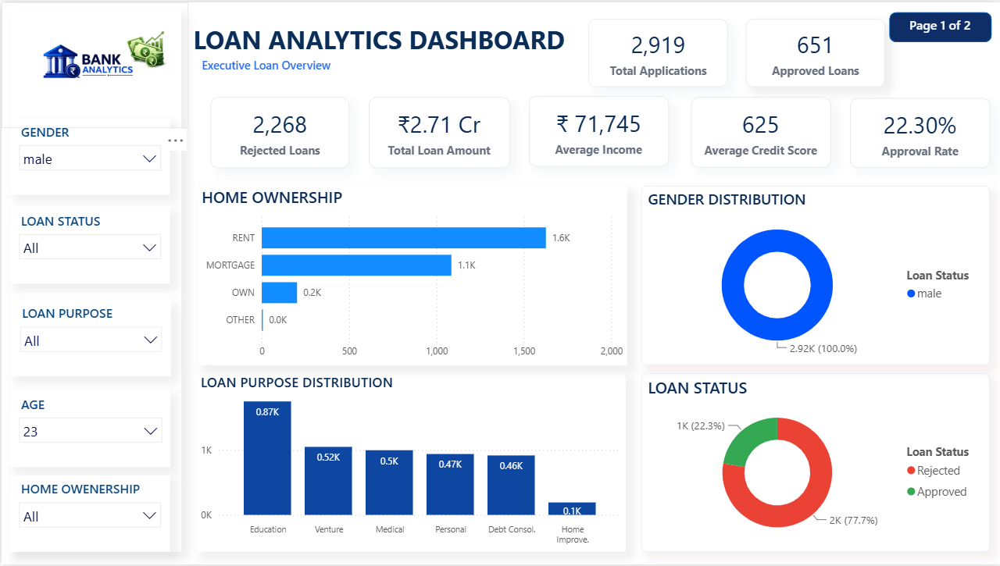
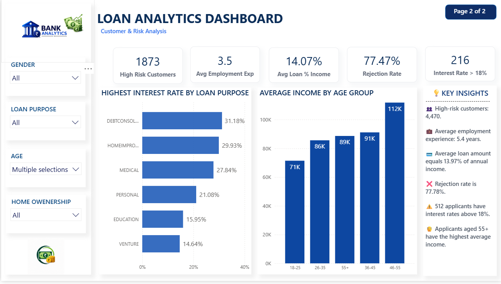

# 📊 Loan Analytics Dashboard

## 📌 Overview

This project is an interactive **Loan Analytics Dashboard** developed using **Power BI**, **DAX**, and **Microsoft Excel**. It provides insights into loan applications, approval trends, customer demographics, income distribution, and customer risk analysis through interactive dashboards.

---

# 📷 Dashboard Preview

## 🔹 Page 1 – Executive Loan Overview

### Dashboard Overview

### KPI & Loan Analysis

### Charts & Distribution

---

## 🔹 Page 2 – Customer & Risk Analysis

### Dashboard Overview

### Customer Risk & Insights

---

# 🚀 Key Features

- 📊 Interactive 2-Page Power BI Dashboard
- 📌 Executive Loan Overview
- 📈 Customer & Risk Analysis
- 📋 Dynamic KPI Cards
- 📊 Loan Purpose Distribution
- 💰 Income Analysis by Age Group
- ⚠️ High-Risk Customer Identification
- 📉 High Interest Loan Analysis
- 🎛️ Interactive Filters & Slicers
- 📌 DAX Measures & Calculations

---

# 📊 Dashboard KPIs

### Executive Overview
- Total Applications
- Approved Loans
- Rejected Loans
- Approval Rate
- Total Loan Amount
- Average Income
- Average Credit Score

### Customer & Risk Analysis
- High Risk Customers
- Average Employment Experience
- Average Loan % of Income
- Rejection Rate
- Interest Rate > 18%

---

# 🛠️ Tools & Technologies

- Microsoft Power BI
- DAX (Data Analysis Expressions)
- Microsoft Excel
- Data Visualization
- Business Intelligence

---

# 📂 Project Files

- 📄 LOAN ANALYSIS DASHBOARD.pbix
- 📊 loan_data (1).xlsx
- 🖼️ Dashboard Screenshots

---

# 💡 Key Insights

- 45,000 loan applications analyzed.
- Approval rate stands at **22.22%**.
- Rejection rate is **77.78%**.
- 512 loans have an interest rate above **18%**.
- Applicants aged **55+** have the highest average income.
- High-risk customers identified: **4,470**.
- Average employment experience is **5.4 years**.
- Average loan amount equals **13.97%** of annual income.

---

# 👨‍💻 Author

**Mayur Desai**

Aspiring Data Analyst

### Skills
- Power BI
- SQL
- Python
- Excel
- Data Visualization
- DAX
