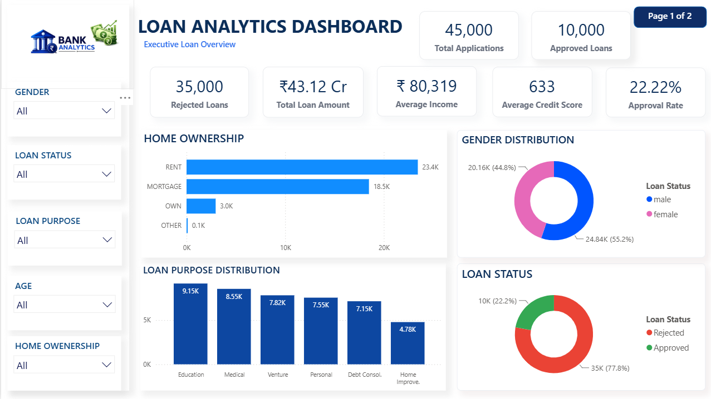
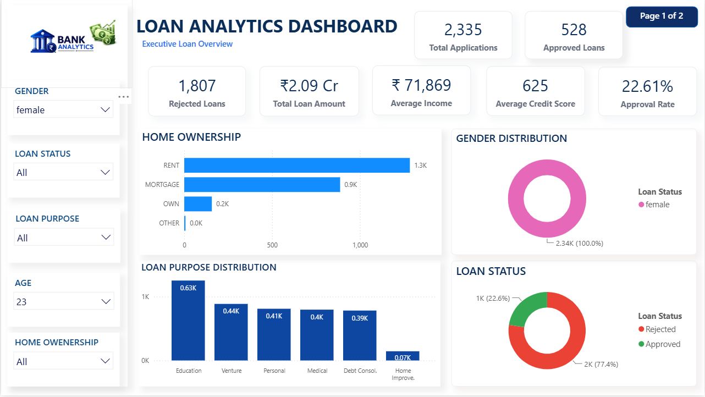
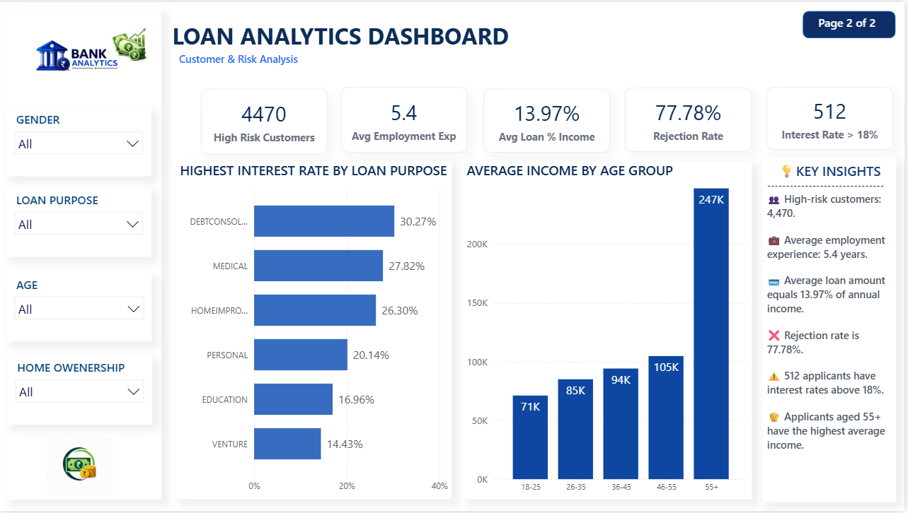

# 📊 Loan Analytics Dashboard

An interactive **2-page Loan Analytics Dashboard** built using **Power BI**, **DAX**, and **Microsoft Excel**. This project analyzes loan applications, customer demographics, approval trends, financial risk, and income patterns through interactive dashboards.

---

# 📷 Dashboard Preview

## 🔹 Page 1 – Executive Loan Overview

### Dashboard Overview

### KPI Cards & Filters

### Charts & Business Analysis

---

## 🔹 Page 2 – Customer & Risk Analysis

### Dashboard Overview

### Risk Analysis & Key Insights

---

# 🚀 Project Highlights

- 📊 Interactive 2-Page Power BI Dashboard
- 📈 Executive Loan Performance Analysis
- 👥 Customer & Risk Analysis
- 💰 Income Analysis by Age Group
- 📋 Dynamic KPI Cards
- 🎛️ Interactive Filters & Slicers
- 📌 DAX Measures & Calculated Columns
- 📉 Loan Approval & Rejection Analysis
- ⚠️ High Risk Customer Identification
- 📊 Professional Dashboard Design

---

# 📊 Dashboard KPIs

## Executive Overview
- Total Applications
- Approved Loans
- Rejected Loans
- Approval Rate
- Total Loan Amount
- Average Income
- Average Credit Score

## Customer & Risk Analysis
- High Risk Customers
- Average Employment Experience
- Average Loan % of Income
- Rejection Rate
- High Interest Loans (>18%)

---

# 💡 Key Insights

- 📌 45,000 loan applications analyzed.
- ✅ Overall approval rate is **22.22%**.
- ❌ Rejection rate stands at **77.78%**.
- ⚠️ 512 applicants have interest rates above **18%**.
- 👥 4,470 customers are classified as high risk.
- 💼 Average employment experience is **5.4 years**.
- 💳 Average loan amount equals **13.97%** of annual income.
- 👴 Applicants aged **55+** have the highest average income.
- 📈 Debt Consolidation loans record the highest interest rates.
- 💰 Average applicant income is **₹80.3K**.

---

# 🛠️ Tools & Technologies

- Microsoft Power BI
- DAX (Data Analysis Expressions)
- Microsoft Excel
- Data Visualization
- Business Intelligence

---

# 📂 Repository Contents

- 📄 LOAN ANALYSIS DASHBOARD.pbix
- 📊 loan_data.xlsx
- 🖼️ Dashboard Screenshots
- 📘 README.md

---

# 📈 Skills Demonstrated

- Data Cleaning
- Data Modeling
- DAX Calculations
- KPI Development
- Dashboard Design
- Interactive Filtering
- Business Insights
- Data Visualization

---

# 👨‍💻 Author

## Mayur Desai

**Aspiring Data Analyst**

### Skills
- Power BI
- SQL
- Python
- Microsoft Excel
- DAX
- Data Visualization
- Business Intelligence
